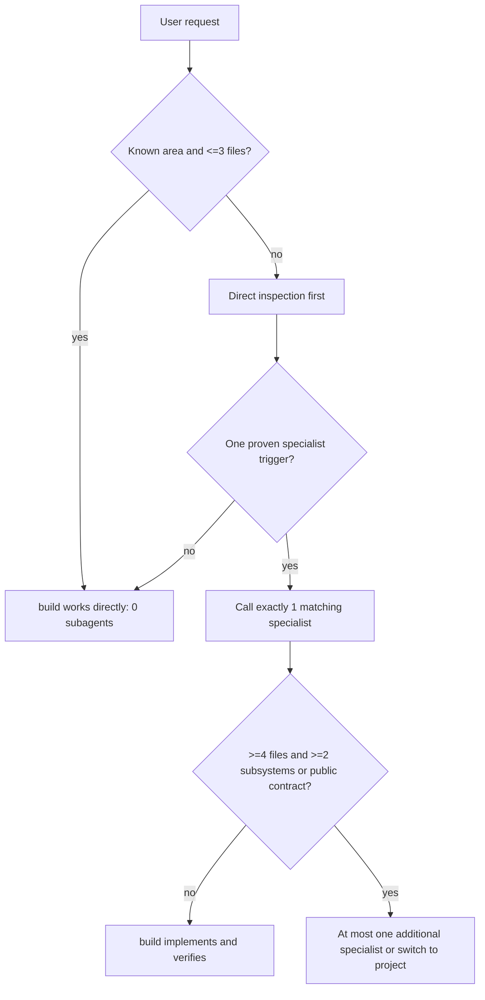

# Agent call graph

Edges show which subagents a primary agent is permitted to call. They do **not** mean those agents run automatically.

```mermaid
flowchart LR
  build["build"]
  plan["plan"]
  project["project"]
  research["research"]
  browser["browser"]
  security["security"]
  ctf["ctf"]
  infra["infra"]
  docs["docs"]
  architect["architect"]
  browser_checker["browser-checker"]
  ctf_lead["ctf-lead"]
  debugger["debugger"]
  designer["designer"]
  docs_writer["docs-writer"]
  explore["explore"]
  forensics["forensics"]
  implementer["implementer"]
  incident_review["incident-review"]
  infra_reviewer["infra-reviewer"]
  performance_reviewer["performance-reviewer"]
  repo_analyst["repo-analyst"]
  researcher["researcher"]
  reverse_engineer["reverse-engineer"]
  reviewer["reviewer"]
  scout["scout"]
  security_review["security-review"]
  setup_maintainer["setup-maintainer"]
  simplicity_reviewer["simplicity-reviewer"]
  skeptic["skeptic"]
  spec_reviewer["spec-reviewer"]
  sysadmin["sysadmin"]
  test_strategist["test-strategist"]
  tester["tester"]
  work_research["work-research"]
  build --> explore
  build --> researcher
  build --> debugger
  build --> reviewer
  build --> security_review
  build --> designer
  build --> setup_maintainer
  plan --> explore
  plan --> researcher
  plan --> architect
  plan --> skeptic
  plan --> security_review
  plan --> performance_reviewer
  project --> explore
  project --> repo_analyst
  project --> architect
  project --> implementer
  project --> debugger
  project --> tester
  project --> reviewer
  project --> spec_reviewer
  project --> test_strategist
  project --> skeptic
  project --> simplicity_reviewer
  project --> performance_reviewer
  project --> security_review
  project --> researcher
  project --> docs_writer
  project --> infra_reviewer
  project --> designer
  research --> scout
  research --> researcher
  research --> work_research
  research --> repo_analyst
  browser --> browser_checker
  browser --> designer
  browser --> tester
  browser --> researcher
  security --> security_review
  security --> forensics
  security --> reverse_engineer
  security --> incident_review
  security --> researcher
  security --> repo_analyst
  ctf --> ctf_lead
  ctf --> forensics
  ctf --> reverse_engineer
  ctf --> researcher
  ctf --> security_review
  infra --> infra_reviewer
  infra --> sysadmin
  infra --> incident_review
  infra --> security_review
  infra --> researcher
  docs --> docs_writer
  docs --> work_research
  docs --> researcher
  docs --> reviewer
  style build fill:#dbeafe,stroke:#475569,stroke-width:2px
  style plan fill:#ede9fe,stroke:#475569,stroke-width:2px
  style project fill:#fae8ff,stroke:#475569,stroke-width:2px
  style research fill:#dcfce7,stroke:#475569,stroke-width:2px
  style browser fill:#cffafe,stroke:#475569,stroke-width:2px
  style security fill:#fee2e2,stroke:#475569,stroke-width:2px
  style ctf fill:#ffedd5,stroke:#475569,stroke-width:2px
  style infra fill:#fef3c7,stroke:#475569,stroke-width:2px
  style docs fill:#f1f5f9,stroke:#475569,stroke-width:2px
```

## Allowed calls by primary

- **`build`** → `explore`, `researcher`, `debugger`, `reviewer`, `security-review`, `designer`, `setup-maintainer`
- **`plan`** → `explore`, `researcher`, `architect`, `skeptic`, `security-review`, `performance-reviewer`
- **`project`** → `explore`, `repo-analyst`, `architect`, `implementer`, `debugger`, `tester`, `reviewer`, `spec-reviewer`, `test-strategist`, `skeptic`, `simplicity-reviewer`, `performance-reviewer`, `security-review`, `researcher`, `docs-writer`, `infra-reviewer`, `designer`
- **`research`** → `scout`, `researcher`, `work-research`, `repo-analyst`
- **`browser`** → `browser-checker`, `designer`, `tester`, `researcher`
- **`security`** → `security-review`, `forensics`, `reverse-engineer`, `incident-review`, `researcher`, `repo-analyst`
- **`ctf`** → `ctf-lead`, `forensics`, `reverse-engineer`, `researcher`, `security-review`
- **`infra`** → `infra-reviewer`, `sysadmin`, `incident-review`, `security-review`, `researcher`
- **`docs`** → `docs-writer`, `work-research`, `researcher`, `reviewer`

## Default build escalation

